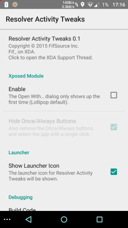

# Resolver Activity Tweaks

Master: 

Coverity:  

Yes, it now works on Pie with EdXposed!™

## Requirements:

* Lollipop 5.0 or higher. Works on Lollipop, Marshmallow, Nougat, Oreo
  and Pie.

* An AOSP ROM.

* Xposed or EdXposed.

## Features:

This module changes the look and behavior of the dialog shown when
picking an activity (app) to open a URL or document (intent).

On Lollipop, by default, you get a list of apps the very first time a
given document type is opened.  Then, for the subsequent times, the
last app is shown at the top, with an "Always" and a "Once" buttons,
and the other apps are pushed down another header.

With this module you can pretty much remove some of the space wasted
by all the headers and buttons by:

* Always using the "first time" menu, where the Always and Once
  buttons are shown at the bottom.

* Also hiding the Always and Once buttons too. In this case a single
  tap on the App name will launch the activity, and you won't be able
  to mark an app to "Always" launch any more.

These are the three possible configurations:

* Stock:

  

* Always use first time intent chooser (with the last selected app
  promoted to the top):

  

* Always use first time chooser and remove Always/Once:

  

Finally this is how the app looks:

## Support and links

* Support is provided in the [dedicated XDA
  thread](http://forum.xda-developers.com/xposed/modules/mod-resolver-activity-tweaks-0-1-t3216445/).

* Download from the [Xposed Modules
  Repository](https://repo.xposed.info/module/com.fifsource.android.resolveractivitytweaks).
  
## Credits

* [Remote Preferences](https://github.com/apsun/RemotePreferences) java 
  library from [Andrew Sun](https://github.com/apsun)

* I copied the [`getContext()` method](https://github.com/M66B/XPrivacyLua/blob/410ae46a051be7d7d8d87fab7c13b0680a6d22e2/app/src/main/java/eu/faircode/xlua/XLua.java)
  from [Marcel Bokhorst](https://github.com/M66B)'s
  [XPrivacyLua](https://github.com/M66B/XPrivacyLua) project.

* [Rovo89](https://github.com/rovo89) for [Xposed](https://github.com/rovo89/Xposed).

## Changelog

### 3.0 - February 27, 2019

* Use [Remote Preferences](https://github.com/apsun/RemotePreferences),
  so that we don't depend on `MODE_WORLD_READABLE` ever again.
  
* No reboots are needed anymore when changing settings on all Android
  versions.
  
* Added a license button in the preferences Legal sections, opening
  to the GPLv3 in the GitHub repository.
  
* Now targeting Android SDK 27 (instead of 23).

### 2.1 - February 26, 2019

* EdXposed compatibility.

  The preferences application now looks up both EdXposed Installer as
  well as the regular Xposed Installer.

* Now on [GitHub](https://github.com/F-i-f/ResolverActivityTweaks).

### 2.0 - August 24, 2018

* Oreo Support.

  The way the Once and Always buttons are hidden has been changed in
  this release.

  The code is now simpler, and should work across all supported
  Android releases.

### 1.0.1 - October 11, 2017

* SDK Version back to 23 (MM) as `MODE_WORLD_READABLE` was causing an
  app crash on Nougat.

### 1.0 - October 11, 2017

Cosmetic changes only.

The module is working on Lollipop, Marshmallow and Nougat (this is not
news, version 0.4 was fine as well)

* Updated target SDK to 25 (7.1 Nougat)

* Still show setting toggles when the module not active in Xposed, or
  when there is a version mismatch between the UI and the module (used
  to be hidden).

* Fix intent when opening the Xposed Installer, it could fail on some
  versions of the installer that do not implement the OPEN_SECTION
  intent.

* Log version in Xposed log file upon start-up.

### 0.4 - April 3, 2016

* Rebuilt against Xposed v81.

### 0.3 - March 2, 2016

* Marshmallow 6.0 compatibility.

* Note that because of Xposed limitations on Marshmallow, you will
  have to reboot to enact the changes. On Lollipop, the app is able to
  change the setting on the fly, and no reboot is needed.

### 0.2 - October 3, 2015

* Lollipop 5.0 compatibility: Target SDK v21 instead of v22. Thanks to
  XDA's Curious Boy.

* Fix FCs on CM12.1. Thanks to Alexey71 on XDA.

### 0.1.1 - October 3, 2015

* Fix FC on tablets and other large devices.

### 0.1 - October 3, 2015

* Initial release.
